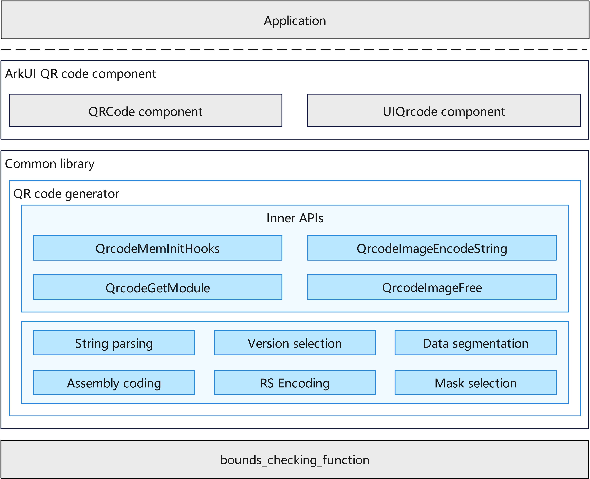

# QRCode Generator<a name="EN-US_TOPIC_0000000000000001"></a>

-   [Introduction](#section1111111111111)
-   [Architecture](#section2222222222222)
-   [Directory Structure](#section3333333333333)
-   [Constraints](#section4444444444444)
-   [Usage](#section5555555555555)
    -   [Available APIs](#section6666666666666)
    -   [Usage Guidelines](#section7777777777777)

-   [Repositories Involved](#section8888888888888)

-   [Third-Party Dependencies](#section9999999999999)

## Introduction<a name="section1111111111111"></a>

The QRCode Generator provides QRCode generation capability for the OpenHarmony system. QRCode is a widely-used encoding technology that has been proven in the market. It features high information capacity, strong reliability, and excellent confidentiality and anti-counterfeiting properties. The QRCode Generator follows the ISO/IEC 18004:2015 standard, supporting QRCode generation from Version 1 to Version 40, with flexible error correction level options.

-   **Encoding Mode Support:** The QRCode Generator supports Numeric mode, Alphanumeric mode, and Byte mode to meet various data encoding requirements.

-   **Error Correction Capability:** Depending on the error correction level, QRCode can be successfully decoded even when 25% to 30% of the codewords are obscured, ensuring the QRCode remains scannable even with partial damage.

-   **Memory Management:** Provides customizable memory allocation hooks, allowing developers to inject their own memory management functions for easier memory optimization on embedded devices.

## Architecture<a name="section2222222222222"></a>

**Figure  1**  QRCode Generator architecture<a name="fig1111111111111"></a>  


-   **Public Interface Layer:** Provides public APIs for QRCode generation, including image encoding and memory management interfaces;

-   **Encoding Core Layer:** Handles core algorithms including data encoding, error correction encoding, and matrix layout;

-   **Data Structure Layer:** Manages QRCode list, block data, and merge code data structures.

## Directory Structure<a name="section3333333333333"></a>

```
/foundation/arkui/qrcode
├── interfaces/kits/qrcode_generator.h    # QRCode Generator public interface
├── interfaces/innerkits/                 # QRCode Generator internal headers
│       ├── qrcode_inner.h                # Internal data structures
│       ├── qrcode_version.h              # Version management
│       ├── qrcode_stream.h               # Data stream processing
│       ├── qrcode_rscode.h               # RS error correction encoding
│       ├── qrcode_mask.h                 # Mask processing
│       ├── qrcode_item.h                 # Data item processing
│       └── qrcode_list.h                 # Linked list operations
├── frameworks/                           # QRCode core implementation
│       ├── qrcode_generator.cpp          # Generator main entry
│       ├── qrcode_version.cpp            # Version processing
│       ├── qrcode_string.cpp             # String processing
│       ├── qrcode_stream.cpp             # Data stream processing
│       ├── qrcode_rscode.cpp             # RS error correction encoding
│       ├── qrcode_mask.cpp               # Mask processing
│       └── qrcode_item.cpp               # Data item processing
├── test/unittest/common/                 # Unit test code
│       ├── qrcode_generator_test.cpp     # Generator test
│       ├── qrcode_version_test.cpp       # Version test
│       ├── qrcode_stream_test.cpp        # Stream test
│       ├── qrcode_item_test.cpp          # Item test
│       ├── qrcode_mask_test.cpp          # Mask test
│       └── qrcode_rscode_test.cpp        # RS code test
└── patches/                              # Patch files
    └── patches.json                      # Patch configuration
```

## Constraints<a name="section4444444444444"></a>

- The QRCode Generator follows the ISO/IEC 18004:2015 standard.
- Supported versions range from Version 1 to Version 40, with a maximum size of 177×177 pixels.
- Input text length is limited by version and error correction level; actual usable length is calculated at runtime.
- The input character stream must not exceed the maximum data capacity of Version 40 at H-level error correction (approximately 1852 bytes). QR codes cannot be generated if this length is exceeded.
- Only square QR code output is supported; other shapes (such as rectangle, circle, etc.) are not supported.
- Byte mode uses UTF-8 encoding by default.

## Usage<a name="section5555555555555"></a>

The QRCode Generator provides public APIs for system components or applications to generate QRCode.

### Available APIs<a name="section6666666666666"></a>

<a name="table1111111111111"></a>
<table><thead align="left"><tr id="row1111111111111"><th class="cellrowborder" valign="top" width="50.22%" id="mcps1.1.3.1.1"><p id="p1111111111111"><a name="p1111111111111"></a><a name="p1111111111111"></a>API</p>
</th>
<th class="cellrowborder" valign="top" width="49.78%" id="mcps1.1.3.1.2"><p id="p2222222222222"><a name="p2222222222222"></a><a name="p2222222222222"></a>Description</p>
</th>
</tr>
</thead>
<tbody><tr id="row2222222222222"><td class="cellrowborder" valign="top" width="50.22%" headers="mcps1.1.3.1.1 "><p id="p3333333333333"><a name="p3333333333333"></a><a name="p3333333333333"></a>QrcodeImage *QrcodeImageEncodeString(const char *text, QRCODE_ECC qrEcc)</p>
</td>
<td class="cellrowborder" valign="top" width="49.78%" headers="mcps1.1.3.1.2 "><p id="p4444444444444"><a name="p4444444444444"></a><a name="p4444444444444"></a>Encodes a string into a QRCode image.</p>
</td>
</tr>
<tr id="row3333333333333"><td class="cellrowborder" valign="top" width="50.22%" headers="mcps1.1.3.1.1 "><p id="p5555555555555"><a name="p5555555555555"></a><a name="p5555555555555"></a>void QrcodeImageFree(QrcodeImage *qrImage)</p>
</td>
<td class="cellrowborder" valign="top" width="49.78%" headers="mcps1.1.3.1.2 "><p id="p6666666666666"><a name="p6666666666666"></a><a name="p6666666666666"></a>Frees QRCode image memory.</p>
</td>
</tr>
<tr id="row4444444444444"><td class="cellrowborder" valign="top" width="50.22%" headers="mcps1.1.3.1.1 "><p id="p7777777777777"><a name="p7777777777777"></a><a name="p7777777777777"></a>void QrcodeMemInitHooks(const QrcodeMemHooks *hooks)</p>
</td>
<td class="cellrowborder" valign="top" width="49.78%" headers="mcps1.1.3.1.2 "><p id="p8888888888888"><a name="p8888888888888"></a>Initializes custom memory allocation hooks.</p>
</td>
</tr>
</tbody>
</table>

#### Error Correction Levels<a name="section6666666666666_ecc"></a>

<a name="table2222222222222"></a>
<table><thead align="left"><tr id="row5555555555555"><th class="cellrowborder" valign="top" width="20%" id="mcps1.1.3.2.1"><p id="p1111111111112"><a name="p1111111111112"></a><a name="p1111111111112"></a>Level</p>
</th>
<th class="cellrowborder" valign="top" width="20%" id="mcps1.1.3.2.2"><p id="p2222222222223"><a name="p2222222222223"></a><a name="p2222222222223"></a>Enum Value</p>
</th>
<th class="cellrowborder" valign="top" width="20%" id="mcps1.1.3.2.3"><p id="p3333333333334"><a name="p3333333333334"></a><a name="p3333333333334"></a>Error Correction Capability</p>
</th>
<th class="cellrowborder" valign="top" width="40%" id="mcps1.1.3.2.4"><p id="p4444444444445"><a name="p4444444444445"></a><a name="p4444444444445"></a>Use Cases</p>
</th>
</tr>
</thead>
<tbody><tr id="row6666666666666"><td class="cellrowborder" valign="top" width="20%" headers="mcps1.1.3.2.1 "><p id="p7777777777778"><a name="p7777777777778"></a><a name="p7777777777778"></a>M (Medium)</p>
</td>
<td class="cellrowborder" valign="top" width="20%" headers="mcps1.1.3.2.2 "><p id="p8888888888889"><a name="p8888888888889"></a><a name="p8888888888889"></a>QRCODE_ECC_MEDIUM</p>
</td>
<td class="cellrowborder" valign="top" width="20%" headers="mcps1.1.3.2.3 "><p id="p9999999999999"><a name="p9999999999999"></a><a name="p9999999999999"></a>Approx. 15%</p>
</td>
<td class="cellrowborder" valign="top" width="40%" headers="mcps1.1.3.2.4 "><p id="p1010101010101"><a name="p1010101010101"></a><a name="p1010101010101"></a>General scenarios, balancing capacity and error correction</p>
</td>
</tr>
<tr id="row7777777777777"><td class="cellrowborder" valign="top" width="20%" headers="mcps1.1.3.2.1 "><p id="p1111111111113"><a name="p1111111111113"></a><a name="p1111111111113"></a>H (High)</p>
</td>
<td class="cellrowborder" valign="top" width="20%" headers="mcps1.1.3.2.2 "><p id="p2222222222224"><a name="p2222222222224"></a><a name="p2222222222224"></a>QRCODE_ECC_HIGH</p>
</td>
<td class="cellrowborder" valign="top" width="20%" headers="mcps1.1.3.2.3 "><p id="p3333333333335"><a name="p3333333333335"></a><a name="p3333333333335"></a>Approx. 30%</p>
</td>
<td class="cellrowborder" valign="top" width="40%" headers="mcps1.1.3.2.4 "><p id="p4444444444446"><a name="p4444444444446"></a><a name="p4444444444446"></a>High reliability requirements (industrial, medical, etc.)</p>
</td>
</tr>
</tbody>
</table>

**Notes:**
- Higher error correction levels allow recovery of more damaged data, but reduce available data capacity.
- Error correction is implemented using Reed-Solomon (RS) codes.

### Usage Guidelines<a name="section7777777777777"></a>

Call the QRCode Generator API to encode text into a QRCode image:

```
QrcodeImage *qrImage = QrcodeImageEncodeString("https://openharmony.cn", QRCODE_ECC_MEDIUM);
if (qrImage != NULL) {
    // Use qrImage->data to generate QRCode image
    // qrImage->width is the image width
    // qrImage->version is the actual QRCode version used
    QrcodeImageFree(qrImage);
}
```

To customize memory allocation:

```
QrcodeMemHooks hooks = {
    .mallocFunc = myMalloc,
    .freeFunc = myFree
};
QrcodeMemInitHooks(&hooks);
```

## Third-Party Dependencies<a name="section9999999999999"></a>

This module depends on the Platform Security Functions Library (bounds_checking_function), which provides secure string processing and memory operation functions. For specific dependency details, refer to the external_deps configuration in the BUILD.gn file.
