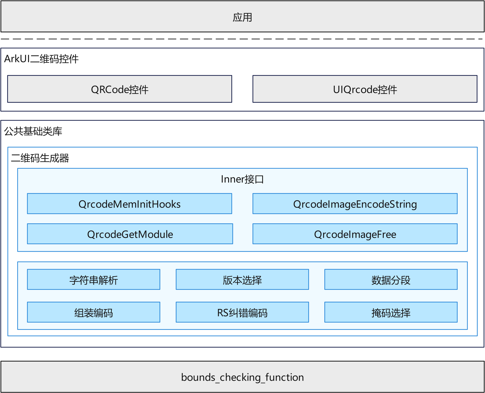

# 二维码生成器<a name="ZH-CN_TOPIC_0000000000000001"></a>

-   [简介](#section1111111111111)
-   [系统架构图](#section2222222222222)
-   [目录](#section3333333333333)
-   [约束](#section4444444444444)
-   [编译构建](#section5555555555555_b)
-   [说明](#section5555555555555)
    -   [接口说明](#section6666666666666)
    -   [使用说明](#section7777777777777)

-   [第三方依赖](#section9999999999999)

## 简介<a name="section1111111111111"></a>

二维码生成器为OpenHarmony系统提供二维码生成能力。二维码是一种经得起市场考验的被广泛使用的编码技术，它具有信息容量大、可靠性高、保密防伪性强的优点。二维码生成器遵循ISO/IEC 18004:2015标准实现，支持Version 1到Version 40的二维码生成，并提供了灵活的错误纠正等级选择。

-   **编码模式支持：** 二维码生成器支持数字模式（Numeric）、字母数字模式（Alphanumeric）和字节模式（Byte），能够满足不同场景下的数据编码需求。

-   **错误纠正能力：** 根据纠错等级的不同，二维码可以在25%到30%的码字被遮挡的情况下成功解码，保证了二维码在部分损坏时仍能被正常扫描。

-   **内存管理：** 提供自定义内存分配钩子，允许开发者注入自己的内存管理函数，便于在嵌入式设备中进行内存优化。

## 系统架构图<a name="section2222222222222"></a>

**图 1**  二维码生成器架构图<a name="fig1111111111111"></a>



-   **对外接口层：** 提供二维码生成的公共API，包括图像编码和内存管理接口；

-   **编码核心层：** 完成数据编码、纠错编码、矩阵布局等核心算法；

-   **数据结构层：** 管理二维码的列表、块数据、合并码等数据结构。

## 目录<a name="section3333333333333"></a>

```
/foundation/arkui/qrcode
├── interfaces/kits/qrcode_generator.h    # 二维码生成器对外接口
├── interfaces/innerkits/                 # 二维码生成器内部头文件
│       ├── qrcode_inner.h                # 内部数据结构定义
│       ├── qrcode_version.h              # 版本管理
│       ├── qrcode_stream.h               # 数据流处理
│       ├── qrcode_rscode.h               # RS纠错编码
│       ├── qrcode_mask.h                 # 掩码处理
│       ├── qrcode_item.h                 # 数据项处理
│       └── qrcode_list.h                 # 链表操作
├── frameworks/                           # 二维码核心实现代码
│       ├── qrcode_generator.cpp          # 生成器主入口
│       ├── qrcode_version.cpp            # 版本处理
│       ├── qrcode_string.cpp             # 字符串处理
│       ├── qrcode_stream.cpp             # 数据流处理
│       ├── qrcode_rscode.cpp             # RS纠错编码
│       ├── qrcode_mask.cpp               # 掩码处理
│       └── qrcode_item.cpp               # 数据项处理
├── test/unittest/common/                 # 单元测试代码
│       ├── qrcode_generator_test.cpp     # 生成器测试
│       ├── qrcode_version_test.cpp       # 版本测试
│       ├── qrcode_stream_test.cpp        # 数据流测试
│       ├── qrcode_item_test.cpp          # 数据项测试
│       ├── qrcode_mask_test.cpp          # 掩码测试
│       └── qrcode_rscode_test.cpp        # RS纠错测试
└── patches/                              # 补丁文件
    └── patches.json                      # 补丁配置
```

## 约束<a name="section4444444444444"></a>

- 二维码生成器遵循ISO/IEC 18004:2015标准。
- 支持的版本范围为Version 1到Version 40，最大尺寸为177×177像素。
- 输入文本长度受版本和纠错等级限制，实际可用长度由运行时计算得出。
- 输入字符码流不得超过Version 40最大版本在H级别纠错下的最大数据容量（约1852字节），超出此长度将无法生成二维码。
- 仅支持正方形二维码输出，不支持其他形状（如矩形、圆形等）。
- 使用字节模式时，默认使用UTF-8编码。

## 编译构建<a name="section5555555555555_b"></a>

根据不同的目标平台，使用以下命令进行编译：

**编译32位ARM系统qrcode部件**

```bash
./build.sh --product-name {product_name} --ccache --build-target qrcodegenerator
```

> **说明：**
> `{product_name}` 为当前支持的平台名称，例如 `rk3568`。

## 说明<a name="section5555555555555"></a>

二维码生成器提供公共接口，供系统组件或应用调用以生成二维码。

### 接口说明<a name="section6666666666666"></a>

<a name="table1111111111111"></a>
<table><thead align="left"><tr id="row1111111111111"><th class="cellrowborder" valign="top" width="50.22%" id="mcps1.1.3.1.1"><p id="p1111111111111"><a name="p1111111111111"></a><a name="p1111111111111"></a>接口名</p>
</th>
<th class="cellrowborder" valign="top" width="49.78%" id="mcps1.1.3.1.2"><p id="p2222222222222"><a name="p2222222222222"></a><a name="p2222222222222"></a>说明</p>
</th>
</tr>
</thead>
<tbody><tr id="row2222222222222"><td class="cellrowborder" valign="top" width="50.22%" headers="mcps1.1.3.1.1 "><p id="p3333333333333"><a name="p3333333333333"></a><a name="p3333333333333"></a>QrcodeImage *QrcodeImageEncodeString(const char *text, QRCODE_ECC qrEcc)</p>
</td>
<td class="cellrowborder" valign="top" width="49.78%" headers="mcps1.1.3.1.2 "><p id="p4444444444444"><a name="p4444444444444"></a><a name="p4444444444444"></a>编码字符串为二维码图像</p>
</td>
</tr>
<tr id="row3333333333333"><td class="cellrowborder" valign="top" width="50.22%" headers="mcps1.1.3.1.1 "><p id="p5555555555555"><a name="p5555555555555"></a><a name="p5555555555555"></a>void QrcodeImageFree(QrcodeImage *qrImage)</p>
</td>
<td class="cellrowborder" valign="top" width="49.78%" headers="mcps1.1.3.1.2 "><p id="p6666666666666"><a name="p6666666666666"></a><a name="p6666666666666"></a>释放二维码图像内存</p>
</td>
</tr>
<tr id="row4444444444444"><td class="cellrowborder" valign="top" width="50.22%" headers="mcps1.1.3.1.1 "><p id="p7777777777777"><a name="p7777777777777"></a><a name="p7777777777777"></a>void QrcodeMemInitHooks(const QrcodeMemHooks *hooks)</p>
</td>
<td class="cellrowborder" valign="top" width="49.78%" headers="mcps1.1.3.1.2 "><p id="p8888888888888"><a name="p8888888888888"></a><a name="p8888888888888"></a>初始化自定义内存分配钩子</p>
</td>
</tr>
</tbody>
</table>

#### 纠错等级说明<a name="section6666666666666_ecc"></a>

<a name="table2222222222222"></a>
<table><thead align="left"><tr id="row5555555555555"><th class="cellrowborder" valign="top" width="20%" id="mcps1.1.3.2.1"><p id="p1111111111112"><a name="p1111111111112"></a><a name="p1111111111112"></a>等级</p>
</th>
<th class="cellrowborder" valign="top" width="20%" id="mcps1.1.3.2.2"><p id="p2222222222223"><a name="p2222222222223"></a><a name="p2222222222223"></a>枚举值</p>
</th>
<th class="cellrowborder" valign="top" width="20%" id="mcps1.1.3.2.3"><p id="p3333333333334"><a name="p3333333333334"></a><a name="p3333333333334"></a>纠错能力</p>
</th>
<th class="cellrowborder" valign="top" width="40%" id="mcps1.1.3.2.4"><p id="p4444444444445"><a name="p4444444444445"></a><a name="p4444444444445"></a>适用场景</p>
</th>
</tr>
</thead>
<tbody><tr id="row6666666666666"><td class="cellrowborder" valign="top" width="20%" headers="mcps1.1.3.2.1 "><p id="p7777777777778"><a name="p7777777777778"></a><a name="p7777777777778"></a>M（中等）</p>
</td>
<td class="cellrowborder" valign="top" width="20%" headers="mcps1.1.3.2.2 "><p id="p8888888888889"><a name="p8888888888889"></a><a name="p8888888888889"></a>QRCODE_ECC_MEDIUM</p>
</td>
<td class="cellrowborder" valign="top" width="20%" headers="mcps1.1.3.2.3 "><p id="p9999999999999"><a name="p9999999999999"></a><a name="p9999999999999"></a>约15%</p>
</td>
<td class="cellrowborder" valign="top" width="40%" headers="mcps1.1.3.2.4 "><p id="p1010101010101"><a name="p1010101010101"></a><a name="p1010101010101"></a>通用场景，兼顾容量与纠错</p>
</td>
</tr>
<tr id="row7777777777777"><td class="cellrowborder" valign="top" width="20%" headers="mcps1.1.3.2.1 "><p id="p1111111111113"><a name="p1111111111113"></a><a name="p1111111111113"></a>H（高级）</p>
</td>
<td class="cellrowborder" valign="top" width="20%" headers="mcps1.1.3.2.2 "><p id="p2222222222224"><a name="p2222222222224"></a><a name="p2222222222224"></a>QRCODE_ECC_HIGH</p>
</td>
<td class="cellrowborder" valign="top" width="20%" headers="mcps1.1.3.2.3 "><p id="p3333333333335"><a name="p3333333333335"></a><a name="p3333333333335"></a>约30%</p>
</td>
<td class="cellrowborder" valign="top" width="40%" headers="mcps1.1.3.2.4 "><p id="p4444444444446"><a name="p4444444444446"></a><a name="p4444444444446"></a>高可靠性需求场景（工业、医疗等）</p>
</td>
</tr>
</tbody>
</table>

**说明：**
- 纠错等级越高，可恢复的损坏比例越大，但可用数据容量相应减少。
- 纠错算法采用 Reed-Solomon（RS）码实现。


### 使用说明<a name="section7777777777777"></a>

调用二维码生成器接口，将文本编码为二维码图像：

```
QrcodeImage *qrImage = QrcodeImageEncodeString("https://openharmony.cn", QRCODE_ECC_MEDIUM);
if (qrImage != NULL) {
    // 使用 qrImage->data 生成二维码图像
    // qrImage->width 为图像宽度
    // qrImage->version 为实际使用的二维码版本
    QrcodeImageFree(qrImage);
}
```

如需自定义内存分配：

```
QrcodeMemHooks hooks = {
    .mallocFunc = myMalloc,
    .freeFunc = myFree
};
QrcodeMemInitHooks(&hooks);
```

## 第三方依赖<a name="section9999999999999"></a>

本模块依赖于平台基础安全函数库（bounds_checking_function），该模块提供安全字符串处理和内存操作函数。具体依赖关系请参见 BUILD.gn 文件中的 external_deps 配置。
